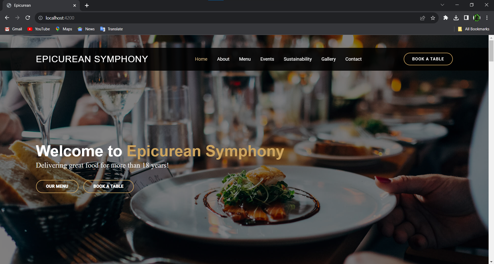

# roxWealth

RoxWealth Frontend Developer Assessment.

## Prerequisites

Before you begin, ensure you have met the following requirements:

- Node.js installed on your machine.
- npm package manager.
- This json server package is installed globally with the command npm install -g json-server

## Getting Started

To get a local copy up and running, follow these simple steps:

### Installation

1. Clone the repository:

   ```bash
   git clone https://github.com/Ashish17032003/roxWealth.git
   ```
2. Navigate to the Cloned Directory

   ```bash
   cd roxWealth
   ```
  
3. Navigate to the frontend directory:

   ```bash
   cd frontend
   ```

4. Install all the dependencies:

   ```bash
   npm i
   ```

5. Navigate to the backend directory:

   ```bash
   cd roxWealth/backend
   ```

5. Start the json server:

   ```bash
   json-server --watch db.json
   ```

6. Open another terminal and navigate to frontend directory and start the frontend server:

   ```bash
   cd roxWealth/frontend
   ng serve
   ```

   This will compile the application and start a development server which should be 
   listening on localhost:4200 by default else you can select other ports that are 
   available.


   Open your web browser and go to http://localhost:4200/.

   This will run the project locally.

   
